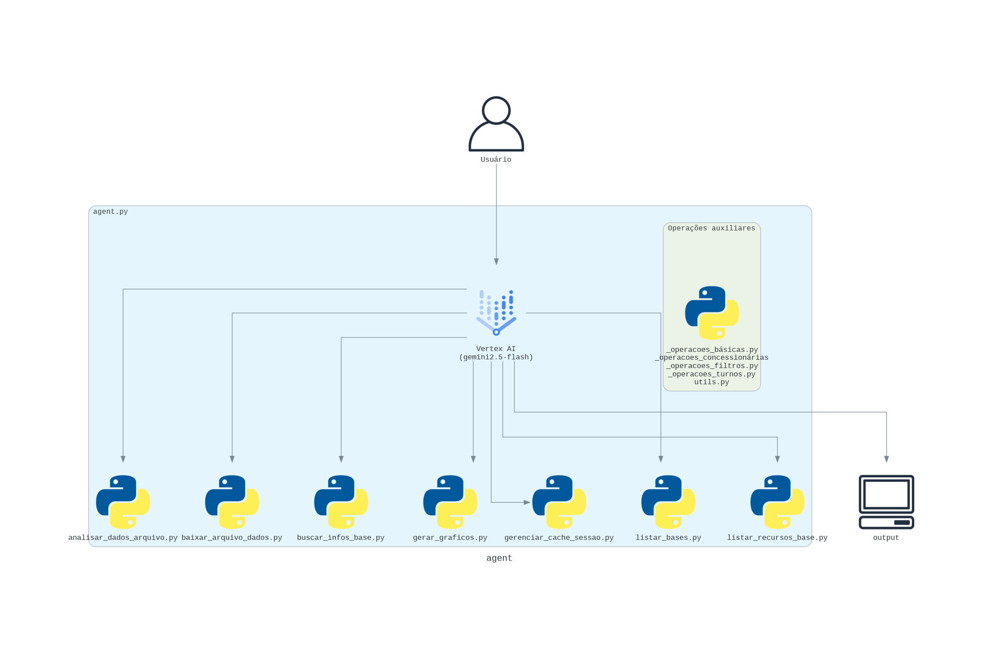

<h1 align="center">  ARCOS-RJ 


---

## Sobre o Projeto

**ARCOS-RJ** é um agente de IA conversacional que está em desenvolvimento como trabalho de conclusão de curso na disciplina de Projeto Final do bacharelado em Ciência da Computação na Universidade do Estado do Rio de Janeiro (UERJ), sob orientação da Profa. Dra. Karla Figueiredo e co-orientação de Me. Fabio Cardoso.

O sistema funciona como um assistente inteligente que facilita o acesso e análise de dados públicos do Rio de Janeiro, abstraindo a complexidade da navegação em plataformas de dados abertos através de uma interface conversacional.

---

## Motivação 

A plataforma [Dados Abertos do RJ](https://dadosabertos.rj.gov.br/) contém um extenso acervo de informações públicas. Os usuários da plataforma enfrentam alguns desafios:

- **Segmentação dos dados**: centenas de bases de dados espalhadas pelo acervo
- **Navegação é confusa**: usuários que não conhecem a plataforma não são capazes de encontrar informações desejadas com facilidade
- **Volume de arquivos**: não há categorização clara dos recursos armazenados
- **Formatos dos arquivos**: diferentes formatos (CSV, XLSX, ZIP, PDF) exigem processamento manual
- **Alta complexidade em análises**: é necessário realizar download dos arquivos para poder visualizar-los. Para fazer análises simples é necessário conhecer ferramentas que manipulem planilhas. 

### Solução sugerida:

ARCOS-RJ se integra à **API de Dados Abertos do RJ**, abstraindo a complexidade técnica da navegação e análise. O usuário pode fazer perguntas em linguagem natural e o agente de IA pode:

- **Localizar** automaticamente a base de dados correta
- **Baixar** e processar arquivos em múltiplos formatos
- **Analisar** os dados conforme solicitado
- **Apresentar** resultados de forma acessível

Dessa forma, tanto um usuário leigo quanto um usuário mais experiente e conhecedor da plataforma de Dados Abertos é capaz de navegar e obter informações com o uso de linguagem natural.

---

## Funcionalidades Disponíveis (WIP)

### Ferramentas/Tools do Agente ARCOS

| Ferramenta/Tool | Descrição | Exemplo de Uso |
|-----------|-----------|-----------------|
| **listar_bases** | Descobre todas as bases disponíveis | "Quais bases de dados existem?" |
| **buscar_infos_base** | Encontra bases por nome ou descrição | "O que é a base de dados X?" |
| **listar_recursos_da_base** | Lista arquivos disponíveis numa base específica | "Quais arquivos existem de janeiro de 2025?" |
| **baixar_arquivo_dados** | Baixa e processa arquivos (CSV, XLSX, ZIP) | Acionada automaticamente quando necessário ler conteúdo dos arquivos |
| **analisar_dados_arquivo** | Executa análises e operações sobre dados | "Quantos idosos andaram de ônibus no dia 5 de Janeiro?"    "Qual tipo de gratuidade usou mais os trens em Dezembro?" |
| **gerar_graficos** | Cria visualizações dos dados | "Gostaria de um gráfico por transações que ocorreram no mês passado" |
| **gerenciar_cache_sessao** | Gerencia cache local de arquivos | "Exclua todos os arquivos baixados nessa sessão" "Mostre os arquivos que foram baixados nessa conversa" |

---

##  Exemplos de Uso

### Exemplo 1: Buscar informação simples

```
👤 Você: Quantas pessoas andaram de ônibus em março?

🏖️ ARCOS-RJ:
   → Identifica base: setram_sgr (gratuidades)
   → Detecta período: março (arquivo consolidado)
   → Baixa dados automaticamente
   → Analisa e filtra por "ÔNIBUS"
   
   Em março de 2025, foram registradas **3.320.000** transações 
   de gratuidade no modal ÔNIBUS. 📊
```

### Exemplo 2: Analisar dados específicos

```
👤 Você: Quantos idosos andaram de metrô em julho do ano passado?

🏖️ ARCOS-RJ:
   → Base: setram_sgr
   → Período: julho de 2024 (consolidado)
   → Localiza linha: METRÔ + Idoso
   
   Em julho de 2024, **500.000** idosos utilizaram o METRÔ 
   através do programa de gratuidade. 
```

### Exemplo 3: Gerar visualização

```
👤 Você: Quero um gráfico com a distribuição de idosos por turno em abril.

🏖️ ARCOS-RJ:
   → Baixa dados de abril
   → Agrupa por turno (manhã, tarde, noite, madrugada)
   → Gera gráfico de barras
   
   📊 Gráfico salvo! [Visualização]
   Maior uso: **Tarde** com 45% das transações.
```

### Exemplo 4: Consultar tarifas

```
👤 Você: Quanto custa a passagem do metrô hoje?

🏖️ ARCOS-RJ:
   → Base: concessionaria-metrorio
   → Operação: leitura_tarifa (atual)
   
   A passagem do MetrôRio hoje custa **R$ 7,90**. 💰
```

---

## 🏗️ Arquitetura (WIP: biblioteca Diagrams)



---

## Como Usar

> [!IMPORTANT]  
> O agente foi desenvolvido em ambiente MacOS. Portanto, algumas ferramentas do projeto podem depender de compatibilidade com Unix.
> No Windows, o uso do *make* pelo PowerShell pode apresentar problemas nas configurações de Path. Dê preferência para o WSL para utilizar os comandos abaixo.

### Instalação

```bash
make create-env
```

### Executar o Agente

```bash
make run
```

---

##  Estrutura do Projeto

```
arcos-rj/
├── agent.py                    # Ponto de entrada principal
├── prompt.py                   # Instruções do agente 
├── tools/                      # Ferramentas disponíveis
│   ├── listar_bases.py
│   ├── buscar_infos_base.py
│   ├── listar_recursos_da_base.py
│   ├── baixar_arquivo_dados.py
│   ├── analisar_dados_arquivo.py
│   ├── gerar_graficos.py
│   ├── gerenciar_cache_sessao.py
│   └── commons/                 
│       ├── _operacoes_basicas.py
│       ├── _operacoes_concessionarias.py
│       ├── _operacoes_filtros.py
│       ├── _operacoes_turnos.py
│       ├── settings.py         # Constantes, configurações
│       └── utils.py            # Processamentos, encondings, detecções

├── tests/                      # Testes de funcionalidades (WIP)
├── requirements.txt
├── .env                        
└── README.md                   
```

---

## 🔐 API Links

```env
# .env: 

URL_LISTAR_BASES=https://dadosabertos.rj.gov.br/api/3/action/package_list?all_fields=true
URL_BUSCAR_BASE=https://dadosabertos.rj.gov.br/api/3/action/package_search?q={}&limit=10
URL_CONSULTAR_PROCESSAR_ARQUIVO=https://dadosabertos.rj.gov.br/api/3/action/package_show?id={}
```

---

## Dados (WIP)

### Bases Principais - Com mais recursos testados durante o desenvolvimento do Agente (WIP)

1. **setram_sgr** - Gratuidades no Transporte
   - Dados consolidados mensais
   - Dados detalhados diários

2. **setram_sbe** - Bilhetagem Eletrônica
   - Validações e embarques
   - Volume de passageiros

3. **concessionaria-metrorio** - Tarifas do Metrô
   - Histórico de preços desde 1998
   - Consultas de preço por período
4. **concessionaria-ccr-barcas** - Tarifas das Barcas
5. **concessionaria-supervia** - Tarifas dos Trens

---

### Linguagem, ferramentas, frameworks, bibliotecas

- **Python 3.13.12**
- **LangChain 1.0.7** - Framework de criação do Agente
- **Google Vertex AI** - Gemini 2.5 Flash
- **LangGraph** - Orquestração  (WIP)
- **Pandas, NumPy** - Processamento de dados
- **Matplotlib** - Geração de gráficos
- **Requests** -  requisição HTTP aos Dados Abertos

---

## Sobre o ARCOS

 Status: **Em Desenvolvimento**

Este projeto está sob orientação de:

- **Prof. Dra. Karla Figueiredo** (Orientadora)
- **Me. Fabio Cardoso** (Co-orientador)

**Departamento de Ciência da Computação**  
**Instituto de Matemática e Estatística (IME)**  
**Universidade do Estado do Rio de Janeiro (UERJ)**


---
